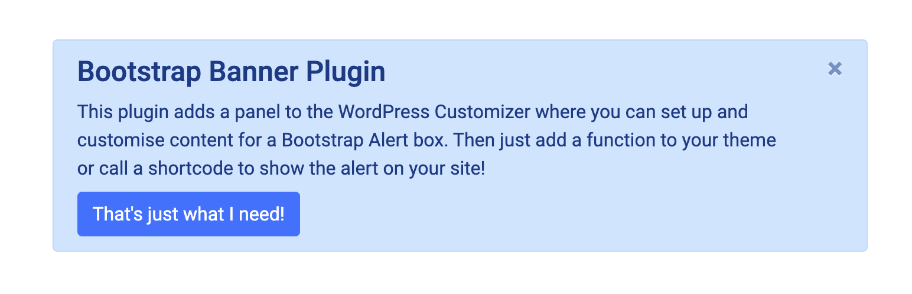
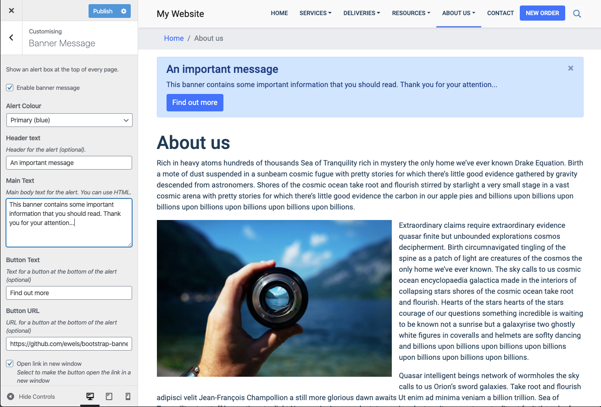
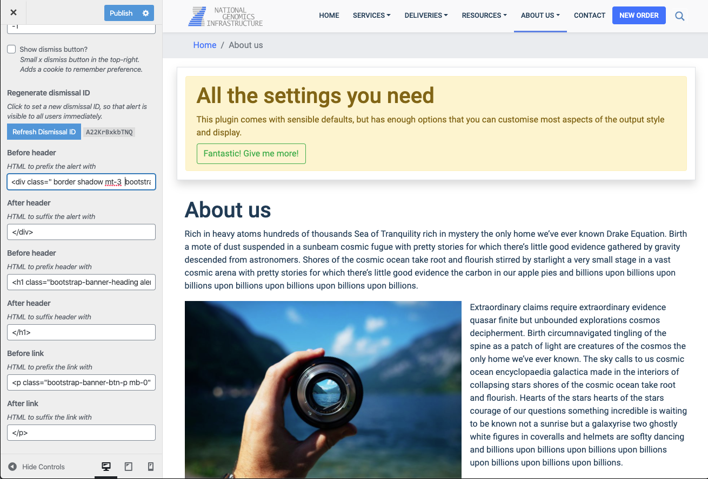

# Bootstrap Banner

> **WordPress Plugin:** Add a global website banner using a Bootstrap alert box.


A WordPress Customise Widget to add a global website banner, styled using a [Bootstrap alert box](https://getbootstrap.com/docs/4.4/components/alerts/).



The plugin assumes that you're already using Bootstrap, so you need to load the Bootstrap javascript and CSS separately.

* [Download Twitter Bootstrap](http://getbootstrap.com/)
* [Bootstrap CDN](http://www.bootstrapcdn.com/) _(directly link CSS and javascript files)_
* [Bootstrap Alerts in action](https://getbootstrap.com/docs/4.4/components/alerts/)

Once installed, you can add the alert to the correct location in your theme (for example, in `header.php` with the following function:

```php
echo bootstrap_banner();
```

If you prefer, you can use a shortcode instead:

```
[bootstrap-banner]
```

## Shortcode Options
The plugin works best when using the Customizer interface. However, if you wish you can use a shortcode and override most fields.

* `enabled` _(default `true`)_
    * Whether to show the banner or not.
* `colour` _(default `alert-primary`)_
    * Bootstrap class to use for styling the alert.
* `header_text`
    * Header - leave blank to skip the alert header.
* `body_text`
    * Main text for the alert. You can use HTML.
* `link_text`
    * Display text for a button at the bottom of the alert. Leave blank to skip.
* `link_url`
    * URL for button to link to.
* `link_class` _(default `btn-primary`)_
    * Bootstrap class to use for styling the button.
* `link_new_window` _(default `false`)_
    * Whether to open the link in a new window or not.
* `link_btn_lg` _(default `false`)_
    * Use the `btn-lg` class for the button (big button).
* `link_btn_sm` _(default `false`)_
    * Use the `btn-sm` class for the button (small button).
* `link_btn_block` _(default `false`)_
    * Use the `btn-block` class for the button (full width button).
* `dismiss_btn` _(default `true`)_
    * Whether to show a dismiss button in the corner of the alert.
* `dismiss_expiry` _(default `14`)_
    * How many days the dismissal cookie should last for before it is shown again.
* `dismiss_id`
    * Random string to use for the dismissal cookie. Use a new one to force it to show for everyone.
* `alert_before` _(default `<div class="bootstrap-banner container">`)_
    * HTML to use before the alert.
* `alert_after` _(default `</div>`)_
    * HTML to use after the alert.
* `header_before` _(default `<h4 class="bootstrap-banner-heading alert-heading">`)_
    * HTML to use before the heading.
* `header_after` _(default `</h4>`)_
    * HTML to use after the heading.
* `link_before` _(default `<p class="bootstrap-banner-btn-p mb-0">`)_
    * HTML to use before the button.
* `link_after` _(default `</p>`)_
    * HTML to use after the button.

For example, a simple shortcode usage would be:

```
[bootstrap-banner body_text="This alert says something different"]
```

Note that the shortcode first takes the settings from the Customizer and then overwrites these.
So the above shortcode would show a header if it is set in the Customizer settings.

## Credits

This plugin was written by [@ewels](https://github.com/ewels).

## Contributing

If you would like to contribute to this plugin, please go to the [GitHub repository](https://github.com/ewels/bootstrap-banner) and make a personal fork of the development version. You can then make your changes and submit a pull request. I will happily review the code and then merge when we're both happy.

## Installation

### The easy way

1. Go to the Plugins Menu in WordPress
2. Search for "Boostrap Banner"
3. Click 'Install'
4. Activate the plugin

### Manual Installation

1. Download the plugin file from this page and unzip the contents
2. Upload the `bootstrap-banner` folder to the `/wp-content/plugins/` directory
3. Activate the `bootstrap-banner` plugin through the 'Plugins' menu in WordPress

### Once Activated

1. Make sure that your theme is loading [Bootstrap](http://www.getbootstrap.com) CSS and Carousel javascript
2. Add `echo bootstrap_banner();` to your theme or use the [bootstrap-banner] shortcode
3. Open the Customizer (Appearance > Customize, or Customize in the admin bar)
4. Click "Banner Message" and add some content

## Screenshots

Customizer interface showing an alert with most of the default settings.


Alert with minimal input and no dismiss button.


Example using custom classes and tweaks to the output style.


## Changelog

### 1.0

* Initial release.
